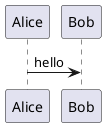

Level 1 heading
=================

# Level 1 heading

Level 2 heading
---------------
## Level 2 heading

### Level 3 heading

#### Level 4 heading

##### Level 5 heading

###### Level 6 heading 

- List item 1
- List item 2
- List item 3

- [ ] Hello
- [X] World

1. One
2. Two
3. Three


# Code

Here is some example code:

```csharp
System.Console.WriteLine("Hello, World!");
```

Here's an external link. It goes to the [.NET API Browser][dotnet-api-browser]. 

<iframe width="100%" height="475" src="https://dotnetfiddle.net/Widget/RMjFg2" frameborder="0"></iframe>

<!--
// This is the code shown in dotnetfiddle.net. It's here so I have access to the code shown in dotnetfiddle in case I want or need to use a different tool.

System.Console.WriteLine("Hello, World!");
-->

Here's some inline code: `int x = 42;`.


Images
======

Static images
-------------


PlantUML diagrams
-----------------

Jekyll needs Liquid tags to render the PlantUML diagrams:


Alice -> Bob : hello


The Visual Studio Code plantuml plugin needs a plantuml code fence to render in the editor. It's wrapped in HTML tags so that it does not render in the visible document. It will still render as an HTML comment.

<!--

-->

Here's how to render the PlantUML code in the source:

```plantumlcode
@startuml
Alice -> Bob : hello
@enduml
```

[dotnet-api-browser]: https://docs.microsoft.com/en-us/dotnet/api/
